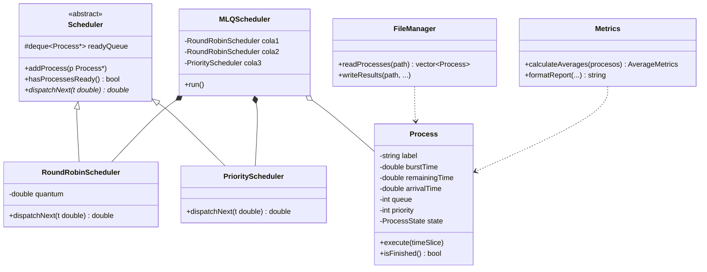
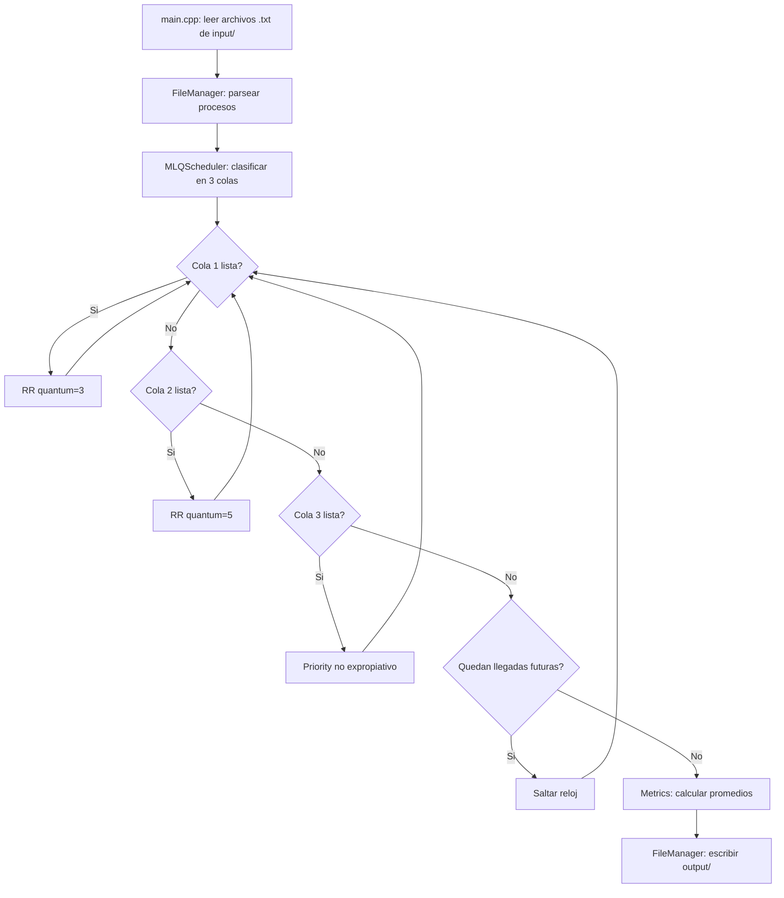

# Simulador de Planificación MLQ (Multilevel Queue Scheduling)

Simulador de planificación de CPU basado en el algoritmo **MLQ (Multilevel Queue Scheduling)**, desarrollado en **C++17** con Programación Orientada a Objetos, para el Primer Parcial de Sistemas Operativos.

**Autor:** Maria Alejandra Pizarro Sarria 
**Código:** 2519474-2724 
---

## Descripción

El programa simula la planificación de procesos distribuidos en **tres colas** con algoritmos y prioridades distintas:

| Cola | Algoritmo | Parámetro |
|---|---|---|
| Cola 1 | Round Robin | Quantum = 3 |
| Cola 2 | Round Robin | Quantum = 5 |
| Cola 3 | Priority Scheduling (no expropiativo) | Mayor número = mayor prioridad |

La **Cola 1 tiene prioridad absoluta sobre la Cola 2**, y la **Cola 2 sobre la Cola 3**: mientras exista un proceso listo en una cola superior, ninguna cola inferior puede despachar procesos.

El programa lee todos los archivos `.txt` de la carpeta `input/`, simula la planificación de cada uno, y escribe los resultados correspondientes en `output/`.

---

## Arquitectura

```
MLQ-Scheduler/
│
├── CMakeLists.txt          # Configuración de compilación
├── Dockerfile               # Imagen de contenedor con GCC 13 + CMake
├── docker-compose.yml       # Orquestación con volúmenes de input/output
├── README.md
│
├── include/                 # Headers (.h) — interfaz de cada clase
│   ├── Process.h
│   ├── Scheduler.h
│   ├── RoundRobinScheduler.h
│   ├── PriorityScheduler.h
│   ├── MLQScheduler.h
│   ├── FileManager.h
│   └── Metrics.h
│
├── src/                     # Implementación (.cpp) de cada clase
│   ├── Process.cpp
│   ├── Scheduler.cpp
│   ├── RoundRobinScheduler.cpp
│   ├── PriorityScheduler.cpp
│   ├── MLQScheduler.cpp
│   ├── FileManager.cpp
│   ├── Metrics.cpp
│   └── main.cpp
│
├── input/                   # Archivos de entrada (.txt)
└── output/                  # Archivos de resultados generados
```

### Responsabilidad de cada clase

| Clase | Responsabilidad |
|---|---|
| **Process** | Representa el estado y las métricas de un proceso individual. |
| **Scheduler** | Clase abstracta que define el contrato común a cualquier algoritmo de planificación (polimorfismo). |
| **RoundRobinScheduler** | Implementa Round Robin con quantum configurable (reutilizada para Cola 1 y Cola 2). |
| **PriorityScheduler** | Implementa Priority Scheduling no expropiativo (Cola 3). |
| **MLQScheduler** | Orquesta las tres colas, el reloj del sistema, y la prioridad estricta entre colas. |
| **FileManager** | Lee los archivos de entrada y escribe los archivos de resultados. |
| **Metrics** | Calcula promedios (WT, CT, RT, TAT) y formatea el reporte final. |

### Diagrama de clases (UML)



### Flujo de ejecución



---

## Formato de archivos

### Entrada (`input/*.txt`)

```
Etiqueta;BurstTime;ArrivalTime;Queue;Priority
```

Ejemplo:
```
A;6;0;1;5
B;9;0;1;4
C;10;0;2;3
D;15;0;2;3
E;8;0;3;2
```

El parser ignora líneas vacías y comentarios (líneas que empiezan con `#`).

### Salida (`output/*_result.txt`)

```
Etiqueta;BT;AT;Queue;Priority;WT;CT;RT;TAT

WT promedio: ...
CT promedio: ...
RT promedio: ...
TAT promedio: ...
```

---

## Compilación y ejecución

### Opción A: Con Docker (recomendado, según lo pedido en el enunciado)

**Requisitos:** Docker Desktop instalado y en ejecución.

```bash
# 1. Construir la imagen
docker build -t mlq_scheduler_image .

# 2. Ejecutar el contenedor (monta input/ y output/ locales)
docker run --rm -v ${PWD}/input:/app/input -v ${PWD}/output:/app/output mlq_scheduler_image
```

El contenedor procesa automáticamente todos los archivos `.txt` de `input/` y escribe los resultados en `output/`.

*(También se incluye `docker-compose.yml` como alternativa equivalente: `docker compose build && docker compose up`, para entornos donde el plugin de Docker Compose esté disponible.)*

### Opción B: Compilación local con CMake

**Requisitos:** compilador compatible con C++17, CMake ≥ 3.10.

```bash
mkdir build && cd build
cmake ..
make
./mlq_scheduler
```

---

## Ejemplo de uso

Con el archivo de entrada `A;6;0;1;5 / B;9;0;1;4 / C;10;0;2;3 / D;15;0;2;3 / E;8;0;3;2`, el programa produce:

| Etiqueta | BT | AT | Q | Pr | WT | CT | RT | TAT |
|---|---|---|---|---|---|---|---|---|
| A | 6 | 0 | 1 | 5 | 3 | 9 | 0 | 9 |
| B | 9 | 0 | 1 | 4 | 6 | 15 | 3 | 15 |
| C | 10 | 0 | 2 | 3 | 20 | 30 | 15 | 30 |
| D | 15 | 0 | 2 | 3 | 25 | 40 | 20 | 40 |
| E | 8 | 0 | 3 | 2 | 40 | 48 | 40 | 48 |

**Promedios:** WT = 18.80 · CT = 28.40 · RT = 15.60 · TAT = 28.40

---

## Explicación del algoritmo

**MLQ (Multilevel Queue Scheduling)** clasifica los procesos en colas fijas (asignadas desde el archivo de entrada, sin reclasificación dinámica), cada una con su propio algoritmo interno, y aplica **prioridad estricta entre colas**: mientras haya al menos un proceso listo en una cola superior, ninguna cola inferior puede ejecutar.

En este proyecto, un proceso que está corriendo en su quantum (Round Robin) **no se interrumpe a mitad de camino** si llega un proceso a una cola superior — la revisión de prioridad entre colas ocurre únicamente en los puntos de decisión (al terminar un proceso o agotarse su quantum), no de forma expropiativa instantánea.

### Fórmulas de las métricas

- **TAT (Turnaround Time)** = CT − AT
- **WT (Waiting Time)** = TAT − BT
- **RT (Response Time)** = tiempo del primer despacho − AT
- **CT (Completion Time)** = instante en que el proceso termina su última ráfaga

---

## Resultados

El simulador fue validado mediante:
1. **Pruebas unitarias por clase**, comparando cada resultado contra una simulación manual calculada a mano.
2. **Prueba de integración completa**, corriendo el ejecutable contra múltiples archivos de entrada simultáneamente.
3. **Validación en contenedor Docker**, confirmando que la compilación con CMake y la ejecución producen resultados idénticos a las pruebas locales.

---

## Buenas prácticas aplicadas

- Encapsulamiento, herencia y polimorfismo (jerarquía `Scheduler`).
- Const correctness en todos los getters.
- Uso exclusivo de contenedores STL (`vector`, `deque`, `algorithm`).
- Separación estricta de responsabilidades (SRP) entre clases.
- Bajo acoplamiento: `FileManager` y `Metrics` no dependen de la lógica de planificación.
